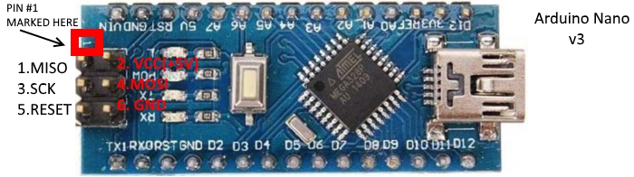

Burn Arduino Nano Bootloader
===

This project demonstrates how to burn an Arduino Nano bootloader through an Arduino Uno from the command line.


<!-- vim-markdown-toc GFM -->

* [Requirements](#requirements)
* [Instructions](#instructions)
* [Connection Guide](#connection-guide)
* [Documentation](#documentation)
    * [Usage](#usage)
    * [1. Make the Uno an ISP](#1-make-the-uno-an-isp)
    * [2. Burn Bootloader to Nano](#2-burn-bootloader-to-nano)
* [Etc](#etc)
    * [Further Reading](#further-reading)
    * [Thanks](#thanks)
    * [Meta](#meta)

<!-- vim-markdown-toc -->

Requirements
---

Software:
1. You must have the [Arduino IDE](https://www.arduino.cc/en/Main/Software) installed and working.

Hardware:
- the Arduino Nano board you wish to burn a bootloader to
- a working [Arduino Uno](https://www.sparkfun.com/products/11021) board that you don't mind overwriting
- the [cable](https://store.arduino.cc/usa/usb-2-0-cable-type-a-b) to connect it to your computer
- 6 [M/F jumper wires](https://www.sparkfun.com/products/9140) to connect the Nano to the Uno

Instructions
---

1. Connect the Uno to your computer.
2. Connect the Nano to a working Uno following the [Connection Guide](#ConnectionGuide) below.
3. At the command line:

```bash
$ cd nano_bootloader
$ make
```


Connection Guide
---


| Nano          | Uno |
| ------------- | --- |
| ICSP #1 MISO  | D12 |
| ICSP #2 5V    | 5V  |
| ICSP #3 SCK   | D13 |
| ICSP #4 MOSI  | D11 |
| ICSP #5 RST   | D10 |
| ICSP #6 GND   | GND |





Documentation
---

#### Usage

```
make isp            -- upload sketch to make Uno into an ISP
make bootloader     -- burn the bootloader to Nano
make                -- do both
```

There are two seperate steps involved in burning the bootloader. They are:

#### 1. Make the Uno an ISP

The directory `isp` contains the sketch `ArduinoISP.ino` that will make the Arduino Uno into an ISP as well as the Makefile to upload it to the board. The sketch is found in the Arduino IDE at `Files > Examples > ArduinoISP > ArduinoISP`, modified here to successfully compile using avr-g++. You can see the sketch comments for additional information.

#### 2. Burn Bootloader to Nano

The `bootloader` directory contains a Makefile to burn the bootloader to the Nano. The variable values were found by burning the bootloader using the Arduino IDE with verbose output enabled. (`Arduino > Preferences > Show verbose output during > compilation/upload`).

Etc
---

#### Further Reading

- [Chinese clone of Arduino Nano with chip CH340G: how to fix it](http://acoptex.com/project/63/chinese-clone-of-arduino-nano-with-chip-ch340g-how-to-fix-it-at-acoptexcom/#sthash.W7qSHpOp.dpbs)
- [How to Burn a Bootloader Clone Arduino Nano 3.0](https://www.instructables.com/id/How-To-Burn-a-Bootloader-to-Clone-Arduino-Nano-30/)
- [Program Arduino Nano Via Uno With ICSP](https://www.instructables.com/id/Program-Arduino-Nano-Via-Uno/)
- [Arduino as ISP to change the bootloader and burn sketches](http://glumb.de/en/arduino-as-isp-to-change-the-bootloader)

#### Thanks
This project depends on [Arduino-Makefile](https://github.com/sudar/Arduino-Makefile) and uses an example sketch from the [Arduino IDE](Arduino).

#### Meta
- Code: `git clone https://github.com/alissa-huskey/nano_bootloader.git`
- Home: https://github.com/alissa-huskey/nano_bootloader

